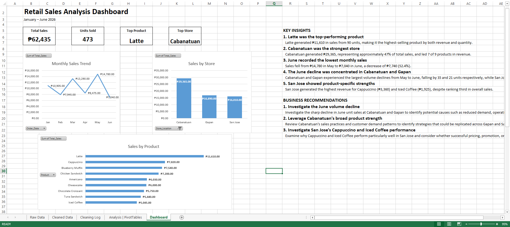
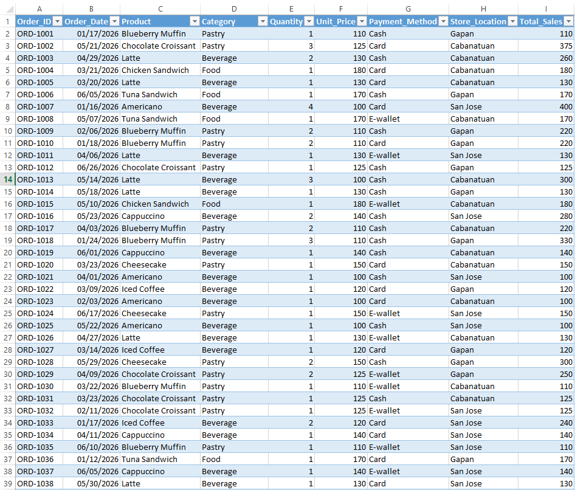

# Retail Sales Performance Analysis
*Disclaimer: This project uses a synthetic dataset created for educational and portfolio purposes. The data is fictional but designed to reflect realistic business scenarios and common data quality challenges. No real customer or business data was used.*

## Overview
>Excel-based retail sales analysis and dashboard project covering data cleaning, exploratory analysis, PivotTables, PivotCharts, and business insights.

## Dashboard Preview

## Source Data

**Business Questions**
- Which products generate the most revenue?
- Which store performs best?
- How does sales performance change over time?
- What products perform particularly well at each store?
- What factors contributed to a decline in sales?

### Tools & Techniques

**Microsoft Excel**
- Data cleaning
- Data validation
- PivotTables
- PivotCharts
- Exploratory data analysis
- Dashboard development

### Key Findings

**Latte was the top-performing product**

- ₱11,610 in revenue from 90 units.

**Cabanatuan was the strongest store**

- ₱29,365 in revenue, representing approximately 47% of total sales.

**June experienced a major decline**

- Sales decreased from ₱14,780 in May to ₱7,040 in June.

**The decline was concentrated in Cabanatuan and Gapan.**

- Unit sales fell by 35 and 21 units respectively.

**San Jose demonstrated product-specific strengths**

- San Jose generated the highest revenue for Cappuccino and Iced Coffee.

## Files Included

| File          | Description   |
| ------------- |:-------------:|
| `Retail_Sales_Analysis_Workbook.xlsx`      |Complete Excel Workbook with Dashboard |
| `dasboard-preview.PNG`     |Dashboard Preview     |
| `data.PNG` |Source Data Preview      |
|`README.md` | Project Information |

## How to Download and Use

1. Download `Retail_Sales_Analysis_Workbook.xlsx`. [Click Here to Download](Retail_Sales_Analysis_Workbook.xlsx)
2. Open with Microsoft Excel
3. Go to the dashboard Worksheet
